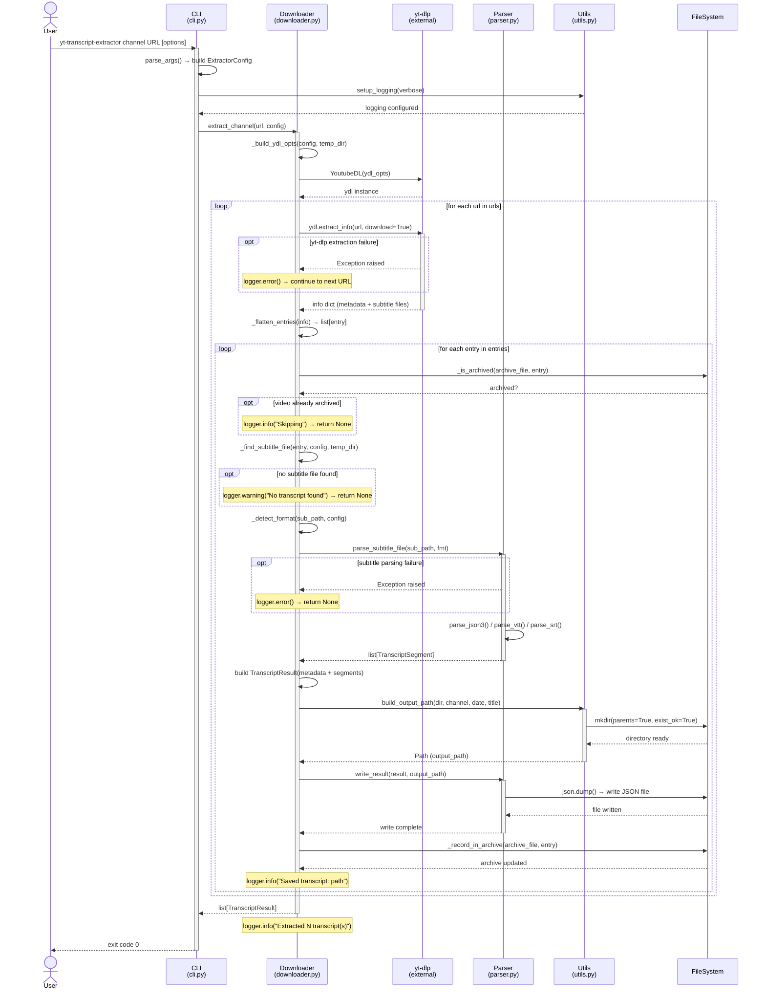

# Sequence Diagram: YouTube Transcript Extraction Flow

## 1. Flow Overview

This document describes the end-to-end flow of extracting transcripts from YouTube videos using the `yt-transcript-extractor` CLI tool. The flow begins when a user executes a CLI command specifying a YouTube channel, playlist, or list of URLs, and ends when enriched transcript JSON files are written to the filesystem.

The application leverages `yt-dlp` as its core extraction engine, downloading only subtitle data (no video files) and enriching it with video metadata such as title, channel name, and upload date. A deduplication mechanism via an archive file ensures that previously processed videos are skipped on subsequent runs.

The flow handles three main alternative paths: videos that have already been archived (skipped), videos where no subtitle/transcript is available (logged as warning), and videos where subtitle parsing fails (logged as error). In all cases, the system continues processing remaining videos gracefully thanks to error isolation per entry.

## 2. Trigger and Scope

| Attribute | Description |
|-----------|-------------|
| **Trigger** | User executes the CLI command: `yt-transcript-extractor {channel\|playlist\|list} <URL> [options]` |
| **Pre-conditions** | Python 3.10+ installed, `yt-dlp` library available, valid YouTube URL(s), network connectivity |
| **Success Outcome** | Enriched JSON transcript files saved to `output_dir/channel/YYYYMMDD - Title.json`, archive file updated |
| **Failure Outcome** | Error logged to stderr; partial results may be saved for successfully processed videos; exit code 1 for file-not-found (list mode) |
| **Scope Start** | User invokes CLI command (`cli.py:main()`) |
| **Scope End** | All transcript files written, archive updated, summary logged (`Extracted N transcript(s)`) |

## 3. Participants

### 3.1 User

| Attribute | Description |
|-----------|-------------|
| **Type** | Actor |
| **Description** | The person or script invoking the CLI tool |
| **Role in Flow** | Initiator — provides URLs and configuration options |
| **Aliases** | None |

### 3.2 CLI

| Attribute | Description |
|-----------|-------------|
| **Type** | Backend Service (module) |
| **Description** | Command-line interface that parses arguments and routes to the appropriate extraction function (`cli.py`) |
| **Role in Flow** | Router — validates input, builds configuration, delegates to Downloader |
| **Aliases** | `cli.py`, `main()` |

### 3.3 Downloader

| Attribute | Description |
|-----------|-------------|
| **Type** | Backend Service (module) |
| **Description** | Core orchestration module that manages the extraction pipeline (`downloader.py`) |
| **Role in Flow** | Processor — coordinates yt-dlp extraction, entry flattening, archive checking, and delegates parsing |
| **Aliases** | `downloader.py`, `extract_transcripts()`, `extract_channel()`, `extract_playlist()` |

### 3.4 yt-dlp

| Attribute | Description |
|-----------|-------------|
| **Type** | External Library |
| **Description** | YouTube video/audio downloader library used to extract metadata and subtitle files |
| **Role in Flow** | Data provider — extracts video metadata and downloads subtitle files to temp directory |
| **Aliases** | `YoutubeDL`, `ydl` |

### 3.5 Parser

| Attribute | Description |
|-----------|-------------|
| **Type** | Backend Service (module) |
| **Description** | Subtitle format parser supporting json3, vtt, and srt formats (`parser.py`) |
| **Role in Flow** | Transformer — converts raw subtitle files into structured `TranscriptSegment` objects and writes JSON output |
| **Aliases** | `parser.py`, `parse_subtitle_file()`, `write_result()` |

### 3.6 Utils

| Attribute | Description |
|-----------|-------------|
| **Type** | Backend Service (module) |
| **Description** | Utility functions for logging, filename sanitization, and path construction (`utils.py`) |
| **Role in Flow** | Helper — provides safe filename generation and output path construction |
| **Aliases** | `utils.py`, `build_output_path()`, `sanitize_filename()` |

### 3.7 FileSystem

| Attribute | Description |
|-----------|-------------|
| **Type** | External System |
| **Description** | Local filesystem where transcript JSON files and the archive file are stored |
| **Role in Flow** | Data store — persists transcript results and deduplication records |
| **Aliases** | `transcripts/`, `archive.txt` |

## 4. Messages — Happy Path

| # | From | To | Message | Type | Response | Notes |
|---|------|----|---------|------|----------|-------|
| 1 | User | CLI | `yt-transcript-extractor channel <URL> [--options]` | Sync | Exit code 0 | CLI entry point via `main()` |
| 2 | CLI | CLI | `build_parser()` + `parse_args()` | Self-call | `args` namespace | Validates arguments, determines mode |
| 3 | CLI | Utils | `setup_logging(verbose)` | Sync | Logging configured | Sets DEBUG or INFO level |
| 4 | CLI | CLI | Build `ExtractorConfig` from args | Self-call | `config` object | Dataclass with all options |
| 5 | CLI | Downloader | `extract_channel(url, config)` | Sync | `list[TranscriptResult]` | Routes based on `args.mode` match |
| 6 | Downloader | Downloader | `_build_ydl_opts(config, temp_dir)` | Self-call | `ydl_opts` dict | Configures skip_download, subtitles, archive, daterange |
| 7 | Downloader | yt-dlp | `YoutubeDL(ydl_opts)` | Sync | `ydl` instance | Creates configured downloader context |
| 8 | Downloader | yt-dlp | `ydl.extract_info(url, download=True)` | Sync | `info` dict (metadata + subtitles) | Downloads subtitle files to temp_dir |
| 9 | Downloader | Downloader | `_flatten_entries(info)` | Self-call | `list[dict]` (flat video entries) | Recursively extracts entries from playlists/channels |
| 10 | Downloader | Downloader | `_process_entry(entry, config, temp_dir)` | Self-call | `TranscriptResult \| None` | Per-video processing pipeline |
| 11 | Downloader | FileSystem | `_is_archived(archive_file, entry)` | Sync | `False` (not archived) | Reads archive.txt, checks for video ID |
| 12 | Downloader | Downloader | `_find_subtitle_file(entry, config, temp_dir)` | Self-call | `Path` to subtitle file | Checks requested_subtitles then scans temp_dir |
| 13 | Downloader | Downloader | `_detect_format(sub_path, config)` | Self-call | Format string (`json3`/`vtt`/`srt`) | Detects from file extension |
| 14 | Downloader | Parser | `parse_subtitle_file(sub_path, fmt)` | Sync | `list[TranscriptSegment]` | Dispatches to format-specific parser |
| 15 | Parser | Parser | `parse_json3(filepath)` / `parse_vtt()` / `parse_srt()` | Self-call | `list[TranscriptSegment]` | Extracts text + timestamps from subtitle file |
| 16 | Downloader | Downloader | Build `TranscriptResult` dataclass | Self-call | `result` object | Combines metadata + segments |
| 17 | Downloader | Utils | `build_output_path(output_dir, channel, date, title)` | Sync | `Path` (output file path) | Sanitizes names, creates `channel/YYYYMMDD - Title.json` |
| 18 | Utils | FileSystem | `mkdir(parents=True, exist_ok=True)` | Sync | Directory created | Creates channel subdirectory if needed |
| 19 | Downloader | Parser | `write_result(result, output_path)` | Sync | JSON file written | Serializes TranscriptResult to JSON with indent=2 |
| 20 | Parser | FileSystem | `open(output_path, "w")` + `json.dump()` | Sync | File written | Enriched transcript JSON saved |
| 21 | Downloader | FileSystem | `_record_in_archive(archive_file, entry)` | Sync | Archive updated | Appends `youtube <video_id>` line |
| 22 | Downloader | CLI | Return `list[TranscriptResult]` | Response | Results list | Summary logged: `Extracted N transcript(s)` |

## 5. Alternative Paths

### 5.1 Video Already Archived

**Type:** opt (optional — early exit)

**Condition:** `_is_archived()` returns `True` — video ID found in `archive.txt`

**After Step:** 11

| # | From | To | Message | Type | Response | Notes |
|---|------|----|---------|------|----------|-------|
| 5.1.1 | Downloader | Downloader | `logger.info("Skipping (already archived): %s")` | Self-call | Log message | Video skipped, returns None |

**Outcome:** Video is skipped entirely, processing continues with next entry.

### 5.2 No Subtitle File Found

**Type:** opt (optional — early exit)

**Condition:** `_find_subtitle_file()` returns `None` — no subtitle in requested_subtitles and no matching file in temp_dir

**After Step:** 12

| # | From | To | Message | Type | Response | Notes |
|---|------|----|---------|------|----------|-------|
| 5.2.1 | Downloader | Downloader | `logger.warning("No transcript found for: %s")` | Self-call | Log warning | Returns None, no file written |

**Outcome:** Video is skipped with a warning, processing continues with next entry.

### 5.3 Subtitle Parsing Failure

**Type:** opt (optional — error handling)

**Condition:** `parse_subtitle_file()` raises an exception (malformed subtitle file, unsupported format)

**After Step:** 14

| # | From | To | Message | Type | Response | Notes |
|---|------|----|---------|------|----------|-------|
| 5.3.1 | Parser | Downloader | Exception raised | Response | Exception object | parse error |
| 5.3.2 | Downloader | Downloader | `logger.error("Failed to parse subtitles for %s: %s")` | Self-call | Log error | Returns None, no file written |

**Outcome:** Video is skipped with an error log, processing continues with next entry.

### 5.4 yt-dlp Extraction Failure

**Type:** opt (optional — error handling)

**Condition:** `ydl.extract_info()` raises an exception (network error, invalid URL, private video)

**After Step:** 8

| # | From | To | Message | Type | Response | Notes |
|---|------|----|---------|------|----------|-------|
| 5.4.1 | yt-dlp | Downloader | Exception raised | Response | Exception object | Network/API error |
| 5.4.2 | Downloader | Downloader | `logger.error("Failed to process %s: %s")` | Self-call | Log error | Continues to next URL |

**Outcome:** URL is skipped with an error log, processing continues with next URL in the list.

### 5.5 File Not Found (List Mode)

**Type:** break (early exit)

**Condition:** `args.mode == "list"` and `file_path.exists()` returns `False`

**After Step:** 2

| # | From | To | Message | Type | Response | Notes |
|---|------|----|---------|------|----------|-------|
| 5.5.1 | CLI | User | `"Error: file not found: {file_path}"` (stderr) | Sync | Exit code 1 | `sys.exit(1)` called |

**Outcome:** Program exits immediately with error code 1.

## 6. Loops and Parallel Execution

### 6.1 URL Processing Loop

**Type:** loop

**Condition:** `for url in urls` — iterates over each URL provided (channel expands to 1 URL, playlist may have multiple)

**After Step:** 7

| # | From | To | Message | Type | Response | Notes |
|---|------|----|---------|------|----------|-------|
| 6.1.1 | Downloader | yt-dlp | `ydl.extract_info(url, download=True)` | Sync | `info` dict | Steps 8-9 execute per URL |
| 6.1.2 | Downloader | Downloader | `_flatten_entries(info)` | Self-call | Flat entry list | Recursive flattening |

### 6.2 Entry Processing Loop

**Type:** loop

**Condition:** `for entry in entries` — iterates over each flattened video entry from a URL

**After Step:** 9

| # | From | To | Message | Type | Response | Notes |
|---|------|----|---------|------|----------|-------|
| 6.2.1 | Downloader | Downloader | `_process_entry(entry, config, temp_dir)` | Self-call | `TranscriptResult \| None` | Steps 10-21 execute per entry |

## 7. Timing and Constraints

| Constraint | Between Steps | Value | Consequence if Violated |
|------------|---------------|-------|------------------------|
| Network timeout | Steps 7-8 | Depends on yt-dlp defaults (~30s per request) | `extract_info` raises exception, URL skipped (alt path 5.4) |
| Temp directory lifecycle | Steps 6-22 | Duration of `extract_transcripts()` call | `tempfile.TemporaryDirectory` auto-cleans on exit; subtitle files lost if accessed after context exits |
| Archive file consistency | Steps 11, 21 | Sequential (no locking) | No concurrent execution supported; parallel runs could cause duplicate processing |

## 8. Observations and Risks

### 8.1 Error Handling Gaps

- **No retry logic:** If `yt-dlp` fails to extract info for a URL (network hiccup), the URL is permanently skipped in that run. No exponential backoff or retry mechanism exists.
- **Silent None handling:** `_flatten_entries` silently drops `None` entries without logging, which could hide issues.

### 8.2 Potential Failure Points

- **yt-dlp API changes:** As an external library wrapping YouTube's unofficial API, breaking changes in YouTube's frontend can cause extraction failures.
- **Archive file corruption:** If the process is killed mid-write to `archive.txt`, the file could be left in an inconsistent state.
- **Disk space:** Large channels with thousands of videos could fill temp directory or output directory.

### 8.3 Design Observations

- **Clean error isolation:** Each video is processed independently within a try/except, preventing one bad video from breaking the entire batch.
- **Efficient resource usage:** `skip_download=True` ensures only subtitle metadata is fetched, not video files.
- **Single-threaded execution:** Processing is sequential. For large channels, parallel entry processing could significantly improve throughput.
- **Archive dual-mechanism:** Both yt-dlp's built-in `download_archive` and the custom `_is_archived()` check handle deduplication, providing redundancy.

## 9. Diagram Specification

### 9.1 Participants (left to right)

| ID | Name | Type | Mermaid Declaration |
|----|------|------|---------------------|
| P1 | User | Actor | `actor User` |
| P2 | CLI | Participant | `participant CLI as CLI (cli.py)` |
| P3 | Downloader | Participant | `participant Downloader as Downloader (downloader.py)` |
| P4 | yt-dlp | Participant | `participant yt_dlp as yt-dlp (external)` |
| P5 | Parser | Participant | `participant Parser as Parser (parser.py)` |
| P6 | Utils | Participant | `participant Utils as Utils (utils.py)` |
| P7 | FileSystem | Participant | `participant FS as FileSystem` |

### 9.2 Messages (top to bottom)

| # | From ID | To ID | Label | Arrow Type |
|---|---------|-------|-------|------------|
| 1 | P1 | P2 | `yt-transcript-extractor channel <URL>` | ->> (sync) |
| 2 | P2 | P2 | `parse_args() → config` | ->> (self) |
| 3 | P2 | P6 | `setup_logging(verbose)` | ->> (sync) |
| 4 | P6 | P2 | `logging configured` | -->> (response) |
| 5 | P2 | P3 | `extract_channel(url, config)` | ->> (sync) |
| 6 | P3 | P4 | `YoutubeDL(ydl_opts)` | ->> (sync) |
| 7 | P4 | P3 | `ydl instance` | -->> (response) |
| 8 | P3 | P4 | `ydl.extract_info(url)` | ->> (sync) |
| 9 | P4 | P3 | `info dict (metadata + subtitles)` | -->> (response) |
| 10 | P3 | P3 | `_flatten_entries(info)` | ->> (self) |
| 11 | P3 | P7 | `_is_archived(archive_file, entry)` | ->> (sync) |
| 12 | P7 | P3 | `False (not archived)` | -->> (response) |
| 13 | P3 | P3 | `_find_subtitle_file()` | ->> (self) |
| 14 | P3 | P5 | `parse_subtitle_file(path, fmt)` | ->> (sync) |
| 15 | P5 | P5 | `parse_json3() / parse_vtt() / parse_srt()` | ->> (self) |
| 16 | P5 | P3 | `list[TranscriptSegment]` | -->> (response) |
| 17 | P3 | P6 | `build_output_path(dir, channel, date, title)` | ->> (sync) |
| 18 | P6 | P7 | `mkdir(parents=True)` | ->> (sync) |
| 19 | P7 | P6 | `directory created` | -->> (response) |
| 20 | P6 | P3 | `Path (output_path)` | -->> (response) |
| 21 | P3 | P5 | `write_result(result, output_path)` | ->> (sync) |
| 22 | P5 | P7 | `json.dump() → write JSON file` | ->> (sync) |
| 23 | P7 | P5 | `file written` | -->> (response) |
| 24 | P5 | P3 | `write complete` | -->> (response) |
| 25 | P3 | P7 | `_record_in_archive(entry)` | ->> (sync) |
| 26 | P7 | P3 | `archive updated` | -->> (response) |
| 27 | P3 | P2 | `list[TranscriptResult]` | -->> (response) |
| 28 | P2 | P1 | `exit code 0` | -->> (response) |

### 9.3 Control Flow Blocks

| Type | Condition | Contains Messages | After Message # |
|------|-----------|-------------------|-----------------|
| loop | for each url in urls | 8-26 | 7 |
| loop | for each entry in entries | 11-26 | 10 |
| opt | _is_archived() == True | skip (return None) | 11 |
| opt | subtitle file not found | log warning, return None | 13 |
| opt | parse exception raised | log error, return None | 14 |
| opt | extract_info exception | log error, continue | 8 |

## 10. References

### 10.1 Source Material

- `src/yt_transcript_extractor/cli.py` — CLI entry point, argument parsing, mode routing
- `src/yt_transcript_extractor/downloader.py` — Core extraction orchestration, yt-dlp integration
- `src/yt_transcript_extractor/parser.py` — Subtitle format parsing (json3, vtt, srt) and JSON output
- `src/yt_transcript_extractor/config.py` — Data classes (ExtractorConfig, TranscriptResult, TranscriptSegment)
- `src/yt_transcript_extractor/utils.py` — Logging setup, filename sanitization, path construction

### 10.2 Related Documentation

- [yt-dlp documentation](https://github.com/yt-dlp/yt-dlp)
- `pyproject.toml` — Project dependencies and build configuration

---

## Diagram (Mermaid)

